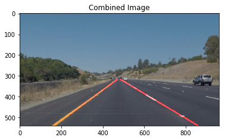

# Simple Lane Lines Identification Project Report

## The goals / steps of this project are the following:

- Identify lane lines in images and videos
- Use image processing methods like Canny Edge Detection and Hough Transforms
- Summarize the results into this written report

This project is graded against this [project rubric](https://review.udacity.com/#!/rubrics/322/view).

## The project requires the following libraries/software:

- Python 3.5.2
- Matplotlib 2.0.0
- Numpy 1.11.3
- OpenCV 3.1.0
- moviepy 0.2.2.11
- IPython 5.1.0
- Jupyter Notebook 4.2.1

## The Image Processing Pipeline

### Colour Filtering

Since we are detecting lane lines, we start by filtering out colours that are unlikely to be lane line related (greens, reds, blues, purples etc). We just want to keep the whites and yellows in the image. Filtering is done with OpenCV&#39;s inRange() method for the following colours:

- Between [R:200, G:93, B:61] and [R:236, G:207, B:154] for pixels in the orange to bright yellow range
- Between [R:190, G:190, B:190] and [R:255, G:255, B:255] for pixels in the light grey to white range.

These value ranges were manually sampled from the driving images with an image editing software.

### Greyscaling

Once the irrelevant colours are stripped out, the remaining pixels are converted to grayscale to simplify processing.

### Gaussian Blur

The image is then blurred to reduce noise

### Canny Edge Detection

Canny Edge Detection is then applied to identify edges in the image

### Region Masking

Irrelevant regions of the image are then masked to reduce noise

### Hough Transform

A Hough Transform is a simple transformation where a line y = mx + c is plotted on **m** vs **c** axes (instead of the usual **x** vs **y** axes). Representing lines this way is useful. It means that lines that are of similar gradients and offsets can be grouped together easily to figure out if they form a larger line together. (in other words, small chunks of disconnected pixels that are lined up together can still be detected as a line!)

### Line Extrapolation

Now that we know where the main lines are in the image, we can extrapolate the information to draw two complete lines to represent where the lane lines most likely are.

### Blend Lines with Original Image

The results are then blended with the original image

## Thoughts and Observations

This project gives an interesting taste of image manipulation to identify lane lines. It was also good to know that even simple mathematical transformations like the Hough Transform can turn out to be so useful. While it works well for the test videos (including the challenge video), this pipeline does not generalize well. It would have problems if the image had an orange/yellow hue (e.g. during sunset), or if the driver was driving in the middle of the road (because the region masking assumes that the car is in the middle of the lane).
